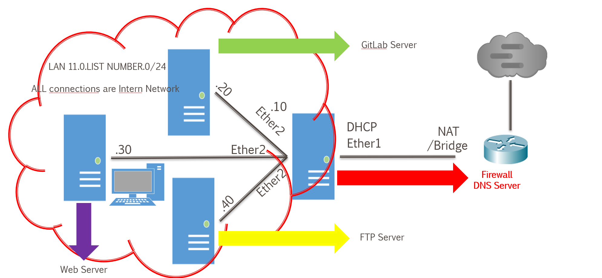

# HelpDNS

escenario de examen:


## 1st step:

Comprobar configuración de red y adaptadores de red (cambiar las MACs porsi).

## 2nd step:

Cambiar, adaptar y/o añadir todo lo necesario a la maquina.

## 3rd step:

Poner las máquinas en la misma red.

## 4th step:

- MV DNS -> RED INTERNA y NAT (PUENTE NO)
- MVs -> RED INTERNA solo

## 5th step:

Configurar IPs en las MVs.

## 6th step:

Vamos a poner nombres de dominio en las MVs.

> sudo nano /etc/netplan/50-cloud-init.yaml

```yaml
.
.
.
nameservers:
  addresses:
    - 10.0.2.2
  search: [aaldaw.local]
```

> resolvetctl

Res: DNS Domain: aaldaw.local

## 7th step:

Vamos a la ruta /etc/bind/named.conf.options

> sudo nano /etc/bind/named.conf.options

```yaml
.
.
.
forwarders {
10.0.2.2;
};
```

Dentro del forwarders ponemos la ip puesta en el via, del netplan.

> sudo systemctl restart bind9
> sudo systemctl status bind9
> nslookup www.google.es
> resolvectl

## 8th step: (Zonas DNS)

> sudo nano /etc/bind/named.conf.local

```yaml
.
.
.
// Zona directa
zone "aaldaw.local" {
type master;
file "/etc/bind/zonas/db.aaldaw.local";
};

// Zona inversa
zone "200.168.192.in-addr.arpa" {
type master;
file "/etc/bind/zonas/db.200.168.192.in-addr.arpa";
};
```

Y guardamos con Ctrl+O y Ctrl+X.

Detro de /etc/bind/ creamos la carpeta zonas

> cd /etc/bind/
> sudo mkdir zonas

## 9th step:

Vamos a duplicar el archivo de zona db.local

> sudo cp db.local zonas/db.aaldaw.local
> sudo nano zonas/db.aaldaw.local

Y añadimos la zona de dominio que queremos añadir.

```yaml
.
.
.
@       IN      NS      ns1.
ns1     IN      A       192.168.200.50
servidor    IN      A       192.168.200.50
cliente     IN      A       192.168.200.114
server      IN      CNAME       servidor
```

Con esta base podemos añadir otras máquinas. Como la de WEB, FTP, etc.

## 10th step:

Añora vamos a por el archivo de la zona inversa.

> sudo cp db.aaldaw.local zonas/db.200.168.192.in-addr.arpa
> sudo nano zonas/db.200.168.192.in-addr.arpa

Y añadimos la zona inversa que queremos añadir.

```yaml
.
.
.
@       IN      NS      ns1.aaldaw.local.
50      IN      PTR     ns1.aaldaw.local.
114     IN      PTR     cliente.aaldaw.local.
```

Con esta base podemos añadir otras máquinas. Como la de WEB, FTP, etc.

## 11th step:

Ahora tenemos que hacer un restart al bind.

> sudo systemctl restart bind9

En caso de fallo:

> sudo named-checkconf
> sudo named-checkzone aaldaw.local /etc/bind/zonas/db.aaldaw.local
> sudo named-checkzone 200.168.192.in-addr.arpa /etc/bind/zonas/db.200.168.192.in-addr.arpa

## 12th step:

Vamos a verificar que el servidor DNS resuelve tanto dominios externos como internos.

> nslookup www.google.es

Resultado esperado:

- Devuelve una IP pública (por ejemplo 172.x.x.x)
- Demuestra que el forwarder funciona

> nslookup aaldaw.local

Resultado esperado:

- Nombre: aaldaw.local
- Dirección: 192.168.200.50 (o la IP de tu servidor DNS)

> nslookup cliente1.aaldaw.local

Resultado esperado:

- Nombre: cliente1.aaldaw.local
- Dirección: 192.168.200.114 (o la IP que hayas configurado)

## 13th step:

Finalmente verificamos que el servicio está activo y sin errores.

> sudo systemctl status bind9

Resultado esperado:

- active (running)
- Sin mensajes de error en rojo

Si aparece algún fallo, revisa con:

> sudo named-checkconf
> sudo named-checkzone aaldaw.local /etc/bind/zonas/db.aaldaw.local
> sudo named-checkzone 200.168.192.in-addr.arpa /etc/bind/zonas/db.200.168.192.in-addr.arpa

## EXTRA

- Comprobar sintaxis: sudo named-checkconf y sudo named-checkzone db.tudominio.local /etc/bind/zones/db.tudominio.local.
- Reiniciar servicio: sudo systemctl restart bind9.
- Verificar estado: sudo systemctl status bind9.
- [Guía de ayuda 1](https://mundowin.com/guia-completa-para-configurar-servidor-dns-en-ubuntu-server/)
- [Guía de ayuda 2](https://blog.baehost.com/tutorial-como-instalar-un-servidor-dns-en-ubuntu-server/)
