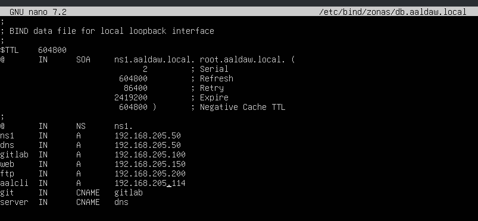
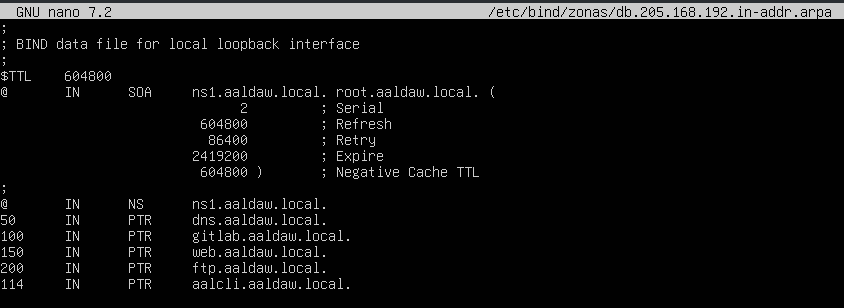
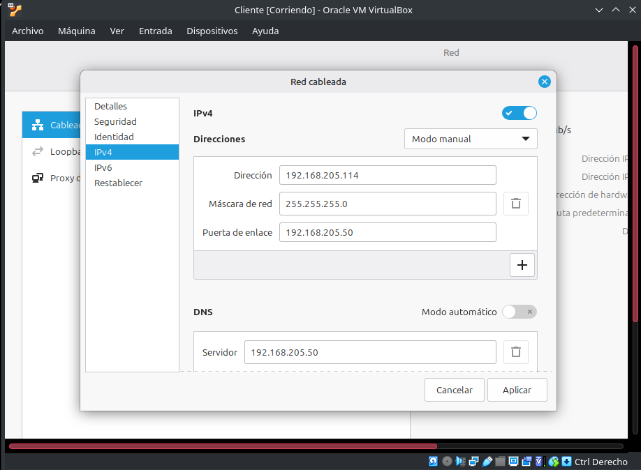
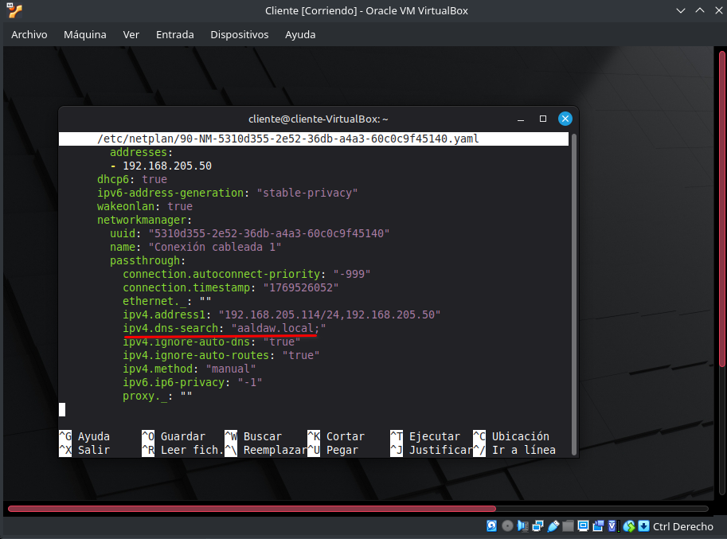

# Help LDAP

## INDEX

1. [Configuración inicial de la MV](#configuración-inicial-de-la-mv)

2. [LDAP (parte 1): Instalar OpenLDAP en Ubuntu](#ldap-parte-1-instalar-openldap-en-ubuntu)

3. [LDAP (parte 2): Iniciar la estructura del directorio](#ldap-parte-2-iniciar-la-estructura-del-directorio)

4. [LDAP (parte 3): Añadir usuarios y grupos de forma manual](#ldap-parte-3-añadir-usuarios-y-grupos-de-forma-manual)

5. [LDAP (parte 4): Buscar, modificar y eliminar elementos del directorio](#ldap-parte-4-buscar-modificar-y-eliminar-elementos-del-directorio)

### Configuración inicial de la MV

#### Comprobar el orden de los adaptadores de red

Normalmente:
enp0s3 --> NAT
enp0s8 --> RED INTERNA

#### Configurar el netplan

```
sudo nano /etc/netplan/50-cloud-init.yaml
```

```bash
network:
  version: 2
  ethernets:
    enp0s3:
      dhcp4: true
    enp0s8:
#      dhcp4: true
      addresses:
        - 192.168.205.50/24
```

```
sudo netplan apply
```

Esto es para poder comprobar el _ip route_ y el _resolvectl_.

```
ip a
ip route
resolvectl
```

**IP A** --> 10.0.2.15

**IP ROTE** --> 10.0.2.2

**RESOLVECTL** --> 10.2.1.254

Con esto podemos volver a abrir el netplan y configurar la dns con IP estática.

```bash
network:
  version: 2
  ethernets:
    enp0s3:
#      dhcp4: true
      addresses:
        - 10.0.2.15/24
      routes:
        - to: default
          via: 10.0.2.2
      nameservers:
        addresses:
          - 10.0.2.15
        search: [aaldaw.local]
    enp0s8:
#      dhcp4: true
      addresses:
        - 192.168.205.50/24
```

Después la IP que devuelve el _resolvectl_ habrá q ponerla en el forwarders.

```
sudo nano /etc/bind/named.conf.options
```

```bash
allow-query { localhost; 192.168.205.0/24; };

forwarders {
        10.2.1.254;
};
```

#### También habrá que retocar las zonas de red

Puede que nos de las zonas ya hechas, ahbrá que cambiar el nombre.

```
sudo nano /etc/bind/named.conf.local
```

```bash
zone "aaldaw.local" {
        type master;
        file "/etc/bind/zonas/db.aaldaw.local";
};

zone "205.168.192.in-addr.arpa" {
        type master;
        file "/etc/bind/zonas/db.205.168.192.in-addr.arpa";
};
```

Ahora nos vamos a los archivos de las zonas.

**Zona directa**


**Zona inversa**


Reiniciamos el servicio **bind9** y comprobamos el status.

```
sudo systemctl restart bind9
sudo systemctl status bind9
```

Comprobamos conexión con google.

```
nslookup www.google.es
```

#### Configuración en cliente

Configuramos la red de nuestro cliente bien por interfaz o bien por consola.



Recuerda entrar en el netplan y comprobar que el dominio sea el correcto.

```
sudo nanp /etc/netplan/90-cloud-init.yaml
```



### LDAP (parte 1): Instalar OpenLDAP en Ubuntu

#### Configuración inicial

```

cat /etc/netplan/00-installer-config.yaml

```


También comprobaremos que los archivos **/etc/hostname** y **/etc/hosts** contienen los nombres adecuados para el servidor.

En el caso de **/etc/hostname**, ejecutar el siguiente comando:

```

sudo hostnamectl set-hostname ldapserver.somebooks.local

```


Con **/etc/hosts** el proceso es un poco más largo: debemos editar el archivo e incluir las líneas que relacionen la _dirección IP_ estática del servidor con los nombres lógicos que tenemos previsto utilizar.

```

sudo nano /etc/hosts

```

Una vez que nos encontramos en el entorno del editor, modificamos la línea que hace referencia al bucle local y añadimos una nueva línea que haga referencia a la dirección IP estática. En definitiva, algo como esto:

```

127.0.1.1 ldapserver.somebooks.local ldapserver
192.168.1.10 ldapserver.somebooks.local ldapserver

```

… pero, como antes, adaptando los nombres a tus necesidades.


**Dudas: http://somebooks.es/proporcionar-un-nuevo-nombre-para-el-equipo-en-ubuntu-20-04-lts/**

#### Instalar el software necesario

Básicamente consiste en instalar el paquete _slapd_, aunque nosotros también instalaremos el paquete que contiene las utilidades de administración de LDAP: _ldap-utils_.

```

sudo apt update -y && sudo apt upgrade -y && sudo apt dist-upgrade -y
sudo apt install slapd ldap-utils -y

```

Aparece el asistente de instalación de OpenLDAP, **no es importante el valor que incluyas ahora, porque después realizaremos la configuración de forma manual.**


#### Realizar la configuración básica

```

sudo dpkg-reconfigure slapd

```

Así conseguiremos que se inicie de nuevo el asistente de configuración, pero esta vez nos pedirá todos los datos.

Lo primero que nos pregunta el asistente es si queremos omitir la configuración de OpenLDAP


Después, deberemos escribir el nombre DNS del dominio que usaremos en nuestro directorio LDAP. En mi ejemplo, usaré el siguiente:

```

somebooks.local

```

… Pero te recuerdo que deberás ajustarlo a tus necesidades.


A continuación, deberemos escribir el nombre de la empresa o entidad en la que estemos realizando la instalación. En mi caso, escribiré lo siguiente:

```

somebooks

```


Lo siguiente será escribir la contraseña de administración. Ahora sí debe ser la buena y, como siempre, deberá ser segura.


Seguidamente, el asistente nos pregunta si queremos eliminar la base de datos de configuración antigua.


Por último, el asistente nos avisa de que aún quedan archivos en la carpeta de LDAP, que pueden estropear el proceso de configuración y nos pide autorización para retirarlos antes de creare la nueva base de datos.


Al hacerlo, se cierra el asistente la ventana vuelve a su aspecto inicia, donde podemos comprobar que las operaciones de configuración se han realizado correctamente.


#### Comprobar la instalación

Una vez concluida la instalación, podemos comprobar que todo es correcto usando el comando **slapcat**:

```

sudo slapcat

```

El objetivo de este comando consiste en obtener la información de la base de datos LDAP.

La salida se produce en formato LDIF, lo que nos facilitará exportar la estructura del directorio LDAP o, sencillamente, obtener una copia de respaldo de su contenido. Para lograrlo, bastará con con redirigir su salida a un archivo.


---

### LDAP (parte 2): Iniciar la estructura del directorio

Crearemos una Unidad organizativa. Este será el elemento lógico que agrupará al resto de los objetos que creemos en el directorio a partir del próximo artículo.

Comenzaremos por abrir un editor de textos, por ejemplo nano, indicándole el nombre de nuestro archivo:

```

sudo nano ou.ldif

```

Una vez abierto el editor, escribiremos un contenido como este:

```

dn: ou=unidad,dc=somebooks,dc=local
objectClass: top
objectClass: organizationalUnit
ou: unidad

```

Como ves, el objeto se llamará unidad, se encuentra en la parte superior de la jerarquía, y es una Unidad organizativa.

Lógicamente, tanto el nombre de la unidad, como los datos del dominio deberás sustituirlos por los valores adecuados para tu implementación.


A continuación, deberemos añadir la información a la base de datos OpenLDAP. Como sabemos, esto se hace con el comando ldapadd:

```

sudo ldapadd -x -D cn=admin,dc=somebooks,dc=local -W -f ou.ldif

```

La salida del comando nos informará si se ha producido algún error.


De cualquier modo, para asegurarnos, basta con ejecutar el comando slapcat:

```

sudo slapcat

```

La salida nos muestra la estructura del directorio hasta el momento, en formado LDIF.


Con esto, estaremos listos para añadir usuarios y grupos a la estructura del directorio.

---

### LDAP (parte 3): Añadir usuarios y grupos de forma manual

Como puedes imaginar, comenzaremos por crear un grupo, y luego un usuario que forme parte de dicho grupo. Así, seguiremos el orden que establece la jerarquía de los objetos.

#### Añadir un grupo

Como hemos dicho antes, para añadir un nuevo grupo, comenzaremos creando un archivo de texto, con extensión ldif. Y para lograrlo, recurriremos a un comando como este:

```

sudo nano grp.ldif

```

Para este ejemplo, llamaremos al archivo grp.ldif, pero tú puedes llamarlo como prefieras

En el área de trabajo del editor, escribiremos un contenido como este:

```

dn: cn=grupo,ou=unidad,dc=somebooks,dc=local
objectClass: top
objectClass: posixGroup
gidNumber: 10000
cn: grupo

```


Con esto ya estamos listos para cargar el nuevo usuario en el directorio. Sólo tenemos que escribir el siguiente comando:

```

sudo ldapadd -x -D cn=admin,dc=somebooks,dc=local -W -f grp.ldif

```

Al momento comprobaremos que el grupo se ha añadido correctamente.


Y para tener la completa certeza de que todo es correcto, solo tenemos que usar el comando slapcat, que nos permite obtener todas las entradas del directorio:

```

sudo slapcat

```


#### Añadir un usuario

Para lograrlo, usaremos el comando **slappasswd** que produce, a partir de la contraseña original, un _hash_ utilizando el algoritmo _SHA-1_ (aunque podríamos cambiar el algoritmo que se aplique usando el argumento **-h**).

Por lo tanto, comenzamos ejecutando el comando **slappasswd**:

```

sudo slappasswd

```

A continuación, el comando nos pide la contraseña que queremos utilizar. Es decir, la que usará inicialmente el usuario que estamos a punto de crear, cuando necesite autenticarse.

Deberemos escribirla por duplicado, como siempre, para evitar errores tipográficos.

Al momento, obtendremos la cadena, codificada con hash _SHA-1_, que equivale a la contraseña que hemos escrito. Debemos copiarla para utilizarla en el archivo ldif que crearemos a continuación.


Ahora sí, ha llegado el momento de crear el archivo ldif para el nuevo usuario. Recuerda que usar el nombre de archivo que prefieras:

```

sudo nano usr.ldif

```

Una vez abierto el editor, escribiremos este contenido:

```

dn: uid=jlopez,ou=unidad,dc=somebooks,dc=local
objectClass: top
objectClass: posixAccount
objectClass: inetOrgPerson
objectClass: person
cn: jlopez
uid: jlopez
ou: grupo
uidNumber: 2000
gidNumber: 10000
homeDirectory: /home/jlopez
loginShell: /bin/bash
userPassword: {SSHA}TWWnxuBaXt1Hx9ohEXqOJPqXZAgm9lwc
sn: Lopez
mail: juan.lopez@somebooks.com
givenName: jlopez

```


Observa que hemos incluido al usuario como miembro del grupo que hemos creado más arriba (**gidNumber: 10000**) y hemos usado la contraseña que hemos generado antes (**userPassword: {SSHA}TWWnxuBaXt1Hx9ohEXqOJPqXZAgm9lwc**).

> Nota:
> En este caso, seguimos la convención de comenzar los UID de los usuarios a partir del valor 2000 (uidNumber: 2000). Así, los siguientes usuarios que creemos de forma manual, recibirán los valores 2001, 2002, etc.
>
> Recuerda que el sistema asigna UID de manera automática a partir de 1000. Si el margen no fuera suficiente, podríamos partir de un valor diferente que nos permitiera ampliar o disminuir el intervalo.

Con esto estamos listos para cargar el nuevo usuario en el directorio. Sólo tenemos que escribir el siguiente comando:

```

sudo ldapadd -x -D cn=admin,dc=somebooks,dc=local -W -f usr.ldif

```

Al momento comprobaremos que el usuario se ha añadido correctamente.


Como antes usaremos el comando slapcat, para obtener todas las entradas del directorio y asegurarnos de que todo es correcto:

```

sudo slapcat

```


<div style="border-left:6px solid #b30000; padding:12px; background:#f8d6d6; border-radius:4px; font-weight:bold;">
  <p>Cuando añadas nuevos usuarios, recuerda que los valores para los atributos uidNumber y homeDirectory deben ser diferentes para cada usuario. También habrá que sustituir el texto mi_password por la contraseña adecuada para el usuario. Lo mismo ocurre con el atributo gidNumber de los grupos. Además, los valores de los campos uidNumber y gidNumber no deben coincidir con el UID y GID de ningún usuario y grupo local.</p>
</div>

#### Recuperar información del usuario

Por último, podemos comprobar que el contenido anterior se recupera
correctamente. Para lograrlo podemos utilizar el comando **ldapsearch**, que nos permite hacer una búsqueda en el directorio.:

```

ldapsearch -xLLL -b "dc=somebooks,dc=local" uid=jlopez sn givenName cn

```

En este ejemplo buscamos un usuario con **uid=jlopez** y pedimos que nos muestre el contenido de los atributos **sn, givenName y cn**.


---

### LDAP (parte 4): Buscar, modificar y eliminar elementos del directorio

#### Planteamiento de partida

Para realizar las tareas de hoy, supondremos que hemos seguido las indicaciones del artículo anterior para crear un nuevo usuario llamado lgomez. En realidad, hemos editado el archivo usr.ldif y hemos cambiado los datos del primer usuario (_jlopez_) para sustituirlos por los des nuevo usuario (_lgomez_). En particular, hemos cambiado los campos **uid**, **cn**, **sn**, **uidNumber**, **homeDirectory** y **givenName**, pero hemos «olvidado» cambiar la dirección de **mail**.

Una vez modificado el archivo, ejecutamos el comando:

#### Buscar elementos del directorio

Como vimos, la utilidad de línea de comandos que permite realizar búsquedas en el directorio LDAP es **ldapsearch**.

Por ejemplo, podríamos buscar todos los usuarios usando la siguiente sintaxis:

```

ldapsearch -xLLL -b "dc=somebooks,dc=local" uid=\* sn givenName mail

```

Aunque no vamos a entrar en muchos detalles, al menos vamos a explicar los argumentos que estamos usando para este ejemplo:

- -x indica que usaremos autentificación simple.

- -LLL sirve para que la salida sea del tipo LDAPv1.

- -b va seguida del punto del árbol donde debe comenzar la búsqueda. En este caso, dc=somebooks,dc=local.

- Después se incluye la condición que deberán cumplir los objetos buscados. En el ejemplo, cualquier valor (\*) para el atributo uid.

- Por último, se incluye el nombre de los atributos que queremos obtener en el resultado de la consulta.

Como puedes ver en la imagen siguiente, el resultado de la consulta se obtiene en formato LDIF, lo que facilitará redirigirlo a un archivo y usarlo como copia de seguridad o incluso como método de exportación de datos a otra implementación de OpenLDAP.


#### Modificar entradas del directorio

Como ya habíamos adelantado al principio, en la imagen anterior nos encontramos un error: el valor del correo electrónico de los dos usuarios es el mismo. Esta situación nos ofrece la excusa perfecta para comprobar cómo podemos cambiar el valor del atributo **mail** para el usuario **lgomez**.

El comando que usaremos en este caso es **ldapmodify**, que permite cambiar el contenido de cualquier atributo, añadir atributos nuevos, eliminarlos etc. Dado que la sintaxis es más compleja nos apoyaremos en un archivo LDIF que especifique los cambios que necesitamos realizar. En nuestro caso, el archivo tendrá el siguiente aspecto:

```

dn: uid=lgomez,ou=unidad,dc=somebooks,dc=local
changetype: modify
replace: mail
mail: luis.gomez@somebooks.local

```

Como puedes suponer, la primera línea identifica la cuenta en la que realizaremos el cambio. La segunda indica el tipo de operación a realizar, la tercera identifica el atributo y, por último, la cuarta incluye el nuevo valor que debe asignarle.

Como en el resto de los artículos, usaremos el editor _nano_ para crear el archivo, que para este ejemplo llamaremos **cambios.ldif**:

```

sudo nano cambios.ldif

```

Una vez abierto el editor, escribimos el texto del ejemplo.


Por último, ejecutamos la utilidad ldapmodify, indicándole el nombre del archivo donde se encuentran los datos:

```

ldapmodify -x -D cn=admin,dc=somebooks,dc=local -W -f cambios.ldif

```


Y para comprobar que los cambios se han efectuado correctamente, basta con volver a utilizar la utilidad **ldapsearch**, tal y como hicimos en el punto anterior.


#### Borrar entradas del directorio

La utilidad que permite eliminar entradas del directorio se llama **ldapdelete**. Para utilizarla, sólo tenemos que aportar los datos del objeto a borrar y los datos de la cuenta administrador que debe permitirlo. La sintaxis será como sigue:

```

ldapdelete -x -W -D 'cn=admin,dc=somebooks,dc=local' "uid=lgomez,ou=unidad,dc=somebooks,dc=local"

```

Después de escribir la contraseña, parecerá que no ha ocurrido nada. Sin embargo, el objeto se habrá eliminado. Para comprobarlo, podemos volver a utilizar la utilidad **ldapsearch** con la misma sintaxis de arriba.


---

```

```

```

```

```

```

```

```

```

```

```

```

```

```
